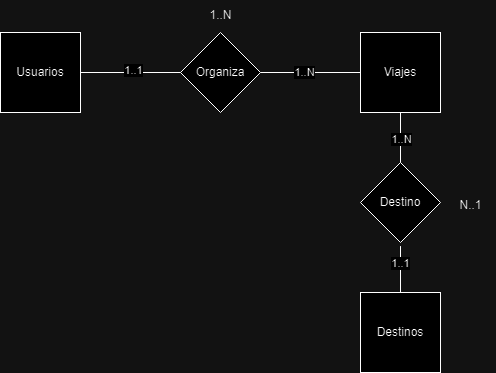

# Viajes con Seguridad JWT

## Idea del Proyecto
En este proyecto se implementará la seguridad JWT en los aspectos de usuario y se manejará de forma segura su token con la información, además de manejar los roles de diferentes usuarios.

## Justificación del Proyecto
Implementar seguridad JWT en un proyecto de viajes garantiza la protección de datos personales , mejora la experiencia del usuario al permitir sesiones continuas , y facilita la escalabilidad y flexibilidad de la aplicación. Además, reduce la carga en el servidor al almacenar tokens en el cliente.

## Descripción Detallada de las Tablas
### Tabla 1: Usuarios
- **Descripción**: Almacena la información de los usuarios.
- **Columnas**:
  - **Columna 1**: id_usuario(PK).
  - **Columna 2**: nombre_usuario(String).
  - **Columna 3**: contraseña(String).
  - **Columna 4**: teléfono(Int)
  - **Columna 5**: rol (“admin”,”user”)(String).

### Tabla 2: Viajes
- **Descripción**: Almacena toda la información del viaje relacionada con el usuario y destino.
- **Columnas**:
  - **Columna 1**: id_viajes(PK).
  - **Columna 2**: descripción(String).
  - **Columna 3**: fecha_ida(Date).
  - **Columna 4**: fecha_regreso(Date).
  - **Columna 5**: id_usuario(FK).
  - **Columna 6**: id_destino(FK).

### Tabla 3: Destinos
- **Descripción**: Almacena todos los destinos de un viaje.
- **Columnas**:
  - **Columna 1**: id_destino(PK).
  - **Columna 2**: nombre(String).
  - **Columna 3**: pais(String).
  - **Columna 4**: descripción(String).

## Entidad-relaión

## API REST Documentation

### **a. Endpoints a desarrollar para cada tabla**

#### **Usuarios**
1. **POST /usuarios/register**: Registrar un nuevo usuario.
2. **POST /usuarios/login**: Autenticar un usuario y generar un token JWT.
3. **GET /usuarios**: Listar todos los usuarios (solo accesible para administradores).
4. **DELETE /usuarios/eliminar/{id}**: Eliminar un usuario por su ID (con restricciones específicas).

#### **Viajes**
1. **GET /viajes**: Obtener todos los viajes del usuario autenticado.
2. **POST /viajes**: Crear un nuevo viaje asociado al usuario autenticado.
3. **PUT /viajes/{id}**: Actualizar un viaje por su ID (solo si pertenece al usuario autenticado).
4. **DELETE /viajes/{id}**: Eliminar un viaje por su ID (solo si pertenece al usuario autenticado).

#### **Destinos**
1. **GET /destinos**: Listar todos los destinos disponibles.
2. **POST /destinos**: Crear un nuevo destino (solo accesible para administradores).
3. **PUT /destinos/{id}**: Actualizar un destino por su ID (solo accesible para administradores).
4. **DELETE /destinos/{id}**: Eliminar un destino por su ID (solo accesible para administradores y si no está asociado a ningún viaje).

---

## **b. Descripción de los endpoints**

### **Usuarios**
1. **POST /usuarios/register**  
   Registrar un nuevo usuario. El usuario envía un JSON con los datos requeridos (nombre de usuario, contraseña, teléfono, etc.). La contraseña se hashea antes de almacenarse.

2. **POST /usuarios/login**  
   Autenticar al usuario mediante su nombre de usuario y contraseña. Si las credenciales son correctas, se devuelve un token JWT.

3. **GET /usuarios**  
   Devuelve una lista de todos los usuarios. Este endpoint está restringido a administradores.

4. **DELETE /usuarios/eliminar/{id}**  
   Elimina un usuario por su ID. No se puede eliminar si el usuario tiene el rol "ADMIN" o si está asociado a viajes.

---

### **Viajes**
1. **GET /viajes**  
   Devuelve todos los viajes asociados al usuario autenticado.

2. **POST /viajes**  
   Crea un nuevo viaje. El viaje queda asociado automáticamente al usuario autenticado.

3. **PUT /viajes/{id}**  
   Permite actualizar un viaje existente. Solo es accesible si el viaje pertenece al usuario autenticado.

4. **DELETE /viajes/{id}**  
   Permite eliminar un viaje existente. Solo es accesible si el viaje pertenece al usuario autenticado.

---

### **Destinos**
1. **GET /destinos**  
   Devuelve una lista de todos los destinos disponibles.

2. **POST /destinos**  
   Permite crear un nuevo destino. Solo accesible para usuarios con el rol "ADMIN".

3. **PUT /destinos/{id}**  
   Permite actualizar un destino por su ID. Solo accesible para administradores.

4. **DELETE /destinos/{id}**  
   Permite eliminar un destino por su ID. El destino no puede ser eliminado si está asociado a viajes. Solo accesible para administradores.

---

## **c. Lógica de negocio de la aplicación**

### **Usuarios**
- La contraseña debe ser hasheada antes de guardarla.
- No se puede registrar un usuario con un nombre de usuario que ya exista.
- Un usuario no puede ser eliminado si:
  - Es un administrador.
  - Está asociado a uno o más viajes.

### **Viajes**
- Un usuario solo puede gestionar (crear, modificar, eliminar) sus propios viajes.
- No se puede asociar un viaje a un destino que ya tenga otro viaje asociado para el mismo usuario.

### **Destinos**
- Solo los administradores pueden crear, actualizar o eliminar destinos.
- No se puede eliminar un destino si está asociado a uno o más viajes.

---

## **d. Excepciones y códigos de estado**

### **Usuarios**
- **400 Bad Request**: 
  - Datos de registro inválidos (por ejemplo, contraseña demasiado corta).
  - Intento de eliminar un usuario no válido.
- **401 Unauthorized**: 
  - Usuario no autenticado.
- **403 Forbidden**: 
  - Intento de acceder o realizar una acción restringida a administradores.
- **404 Not Found**: 
  - Usuario no encontrado al intentar eliminarlo.
- **409 Conflict**: 
  - Intento de eliminar un usuario con rol "ADMIN" o asociado a viajes.

### **Viajes**
- **400 Bad Request**: 
  - Datos de viaje inválidos (por ejemplo, fechas incoherentes).
- **401 Unauthorized**: 
  - Usuario no autenticado.
- **403 Forbidden**: 
  - Intento de acceder, actualizar o eliminar un viaje que no pertenece al usuario autenticado.
- **404 Not Found**: 
  - Viaje no encontrado.
- **409 Conflict**: 
  - Intento de asociar un viaje a un destino ya ocupado por el mismo usuario.

### **Destinos**
- **401 Unauthorized**: 
  - Usuario no autenticado.
- **403 Forbidden**: 
  - Intento de crear, actualizar o eliminar un destino sin ser administrador.
- **404 Not Found**: 
  - Destino no encontrado.
- **409 Conflict**: 
  - Intento de eliminar un destino asociado a viajes.

---

## **e. Restricciones de seguridad**

### **Autenticación**
- Todos los endpoints requieren autenticación mediante JWT, excepto los de registro y login.
- Los tokens tienen una duración limitada y deben renovarse mediante login.

### **Autorización**
- Solo los administradores tienen acceso a la gestión completa de usuarios y destinos.
- Los usuarios solo pueden gestionar sus propios viajes.

### **Validación de datos**
- Las entradas del cliente se validan para evitar inyecciones de datos o errores en las reglas de negocio.
- Se valida el formato del teléfono al registrar usuarios.

### **Control de acceso**
- Restricciones a nivel de servicio para evitar que un usuario acceda o modifique datos que no le pertenecen.
